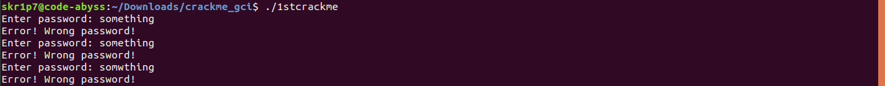

# How to crackme
## Hello there, so this is my write-up about how I successfully cracked the binaries a.k.a crackme(s) provided in a task by Fedora Project in [Google Code-In 2019](https://codein.withgoogle.com).
First of all let's download the binaries and cd into the directory where we have downloaded the binary. For the sake of convenience, I have downloaded all the three binaries. Make note that we will be using some utilities to crack these binaries like:
1. ltrace
2. strings
3. Ghidra or Radare2 (cutter)
## The hash symbol [#] means that this step neads to be repeated for all the binaries

### Who are you ./1stcrackme?
Well, just staring at this file cannot give us any idea of what this binary is, let's do a quich recon on what this file is, use the following command in your terminal:
```bash
$ file ./1stcrackme
```

Okay, so this output tells us that this binary is a ELF 64-bit LSB shared object.

### Let's try to execute the first binary by using the following command:
```bash
$ ./1stcrackme
```


which gives us an annoying behavior but a necessary one. Let's give this binary the executable permissions to this binary using the following command [#1] :
```bash
$ sudo chmod +x ./1stcrackme
```

### Fair enough, let's run the binary using the follwing command [#1] :
```bash
$ ./1stcrackme
```


So with this output on the terminal, we can conclude two thing, either the binary accepts three passwords, or it retries the password attempts thrice and if the password is incorrect even on the third attempt, the binary will exit. 
Not to make it late, let's make the use of ```strings``` utility which I have mentioned before, what it does is that it prints all the printable "strings" in the file. To use this utility, type in the following command in your terminal:
```bash
$ sudo strings ./1stcrackme
```
The output is huge, like seriously HUGE, so not to make this write-up an horror for your mouse wheel/down arrow, let me attach a screenshot:

Interesting, quite a good amount of readable/understandable data, going through all the data (a.k.a gibberish for non CSE folks) and after taking a close look, we have found something very interesting! 
 

Voilà! We have found the password to this binary! Let's fire up the binary and try this password:


Okay so this was the correct password but hold on, we are getting prompt to add another password followed by another prompt, according to which our first assumption was absolutely correct that this binary has three passwords.
What next? Well the ```ltrace``` utility is here to save our day! What it does is is search for the ```strcmp``` calls which compares the input with strings already specified. Use the following command to get started:
```bash
$ ltrace ./1stcrackme
```
As we know the first password i.e. **FEDORAGCIPASSEASY**, we need to feed that as the input end hit Enter,here's what we have got


Note that how the **```ltrace```*** utilility traces the **```strcmp```** calls and how ```**strcmp**``` compares our input with the already stored input. But what for the next two passwords? As we already know that the ```**strcmp**``` function will compare our input with the already stored **string**, let's blindly enter any string that we wish to. I will feed **hellow** to the next two password prompts and this is what we have come up with.


Notice how the string are getting compared again, so for the first **hellow** or the second password, our given input is compared with the e\hex value **0x1337**, for the second **hellow** or the third password,our given input is compared with the e\hex value **0x133337** let's make use of the web to convert this hexacdecimal to integer value:


And we have come to know that **0x1337** is 4919 nad **0x133337** is 1258295, let's try these decimal values as the password:


What is up! The thing is that overthinking often messes up with the easiest routes, actually **0x1337** and **0x133337**is itself a string, let's try using these as strings:

There we go! Wooo 
