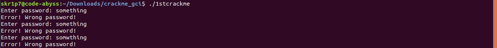

# How to crackme
## Hello there, so this is my write-up about how I successfully cracked the binaries a.k.a crackme(s) provided in a task by Fedora Project in [Google Code-In 2019](https://codein.withgoogle.com).
First of all let's download the binaries and cd into the directory where we have downloaded the binary. For the sake of convenience, I have downloaded all the three binaries. Make note that we will be using some utilities to crack these binaries like:
1. ltrace
2. strings
3. Ghidra or Radare2 (cutter)

### Let's try to execute the first binary by using the following command:
```bash
$ ./1stcrackme
```
which gives us an annoying behavior but a necessary one so that not everyone can execute anything on your Linux machine. Let's give this binary the executable permissions to this binary using the following command:
```bash
$ sudo chmod +x ./1stcrackme
```

### Fair enough, let's run the binary using the follwing command:
```bash
$ ./1stcrackme
